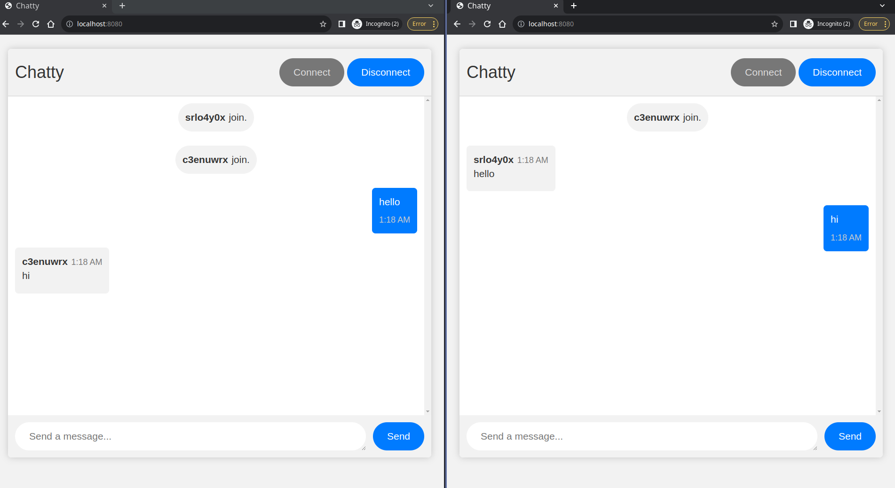

# Chatty

This is a simple chat application built using Spring Boot, MongoDB, and WebSocket.
The application allows users to send and receive messages in real-time.



## How to Install

- Clone this repository:

```
git clone https://github.com/peienxie/spring-websocket-chat-application.git
```

- Build the application:

```
./mvnw clean install
```

- Run the application:

```
java -jar target/chatty-0.0.1-SNAPSHOT.war
```

- Alternatively, you can use the Spring Boot Maven plugin to run the application:

```
./mvnw spring-boot:run
```

- Access the application in your web browser:

```
http://localhost:8080
```

## How to Use

1. Click the "Connect" button to establish websocket connection.
2. Type your message in the input box and hit the "Send" button to send the message.

## TODO

[ ] add user details
[ ] add private messages
[ ] add group messages


